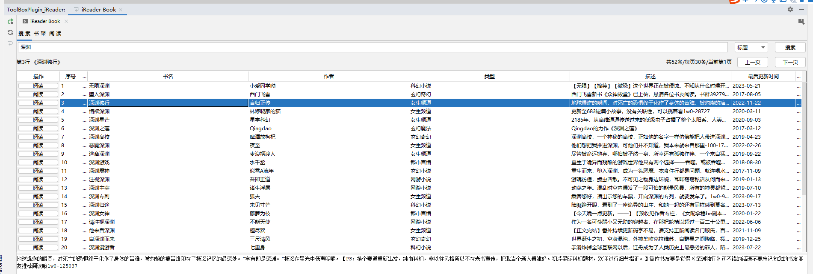
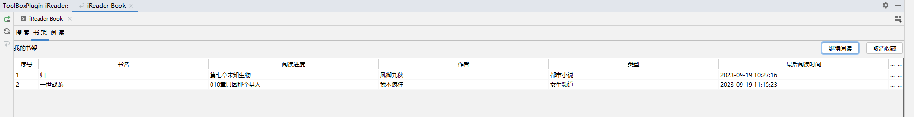
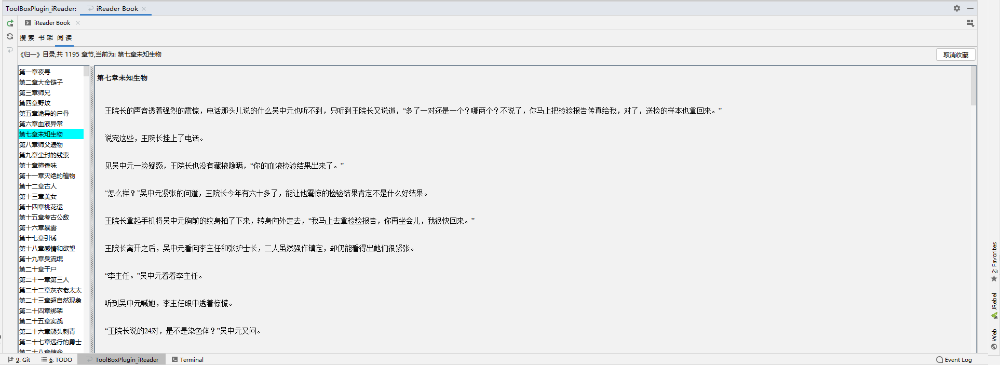

# ToolBoxPlugin

## 介绍
idea插件开发，工具箱
1. 图书模块：搜索图书、阅读图书、图书收藏 
## 技术
java、Gradle、Swing UI、

## 图书模块
> v1.0 支持功能：搜索展示、阅读、收藏\取消收藏、我的书架
>

> v2.2 IRdeader Debug调试模式

> 注意事项: iReader debug调试模式下：
>   1. 调试的图书需满足所有图书章节在同一个页面暂时不支持翻页
>   2. 调试的图书需满足一个章节的正文内容张一个页面展示，暂不支持翻页